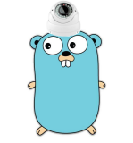
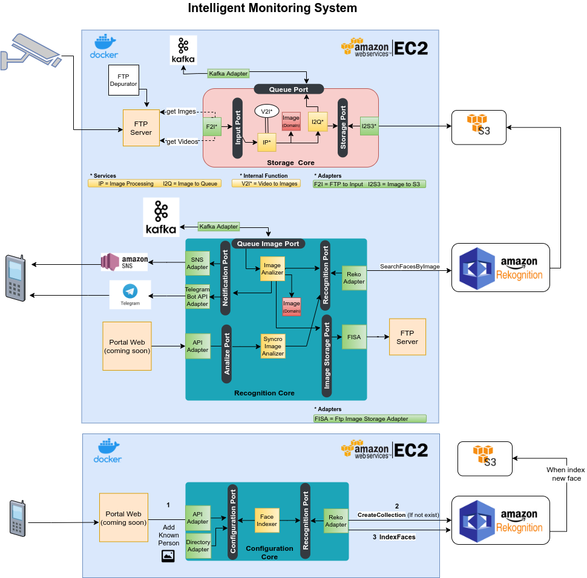

# Intelligent Monitoring System

<h1 align="center"></h1>

Its a Simple free Software to make a monitoring system based on Face Recognition using standars IP cameras. They only need to be able to send images to an FTP Server.

I developed it implementing Hexagonal Architecture (or Ports & Adapters architecture ). You can see on the diagram that is very simple to add anothers adapters to process images. In fact, you can easily change AWS Recognize component with another.

## Architecture

## UML Graphics

[PlantUML](https://github.com/arielbrizi/go-intelligent-monitoring-system/tree/develop/documentation/puml) 

## API Documentation - Swagger
[editor.swagger.io](https://editor.swagger.io/?url=https://raw.githubusercontent.com/arielbrizi/go-intelligent-monitoring-system/develop/docs/swagger.yaml) (It's also automatically published on .../swagger/index.html)
- Documentation about configuration and service annotations: https://github.com/swaggo/gin-swagger 

## Installation

1) Install FTP Server. Recommended: [Install WingFTP in very simple steps](documentation/wingFTP/README.md)

2) Set the Ip of the FTP server in your IP cameras. On movement detection, cameras will send the image captured  to the FTP server defined.

3) Notification Configuration. You can choose 2 options (adapters)
    - Telegram 
        - [Create BOT ](https://core.telegram.org/bots#3-how-do-i-create-a-bot)
        You can do it from your mobile-app. You will use the Bot to receive notifications and send him "commands" using telegram chat.
        - Create a Telegram channel from your mobile-app. The bot can only send notifications to channels. You can add all the people you want to this channel to receive notifications.
    - AWS SNS 
        - [Create AWS SNS Topic](https://docs.aws.amazon.com/sns/latest/dg/sns-create-topic.html)
        - [Create topic subscription (e-mail, SMS, etc)](https://docs.aws.amazon.com/sns/latest/dg/sns-create-subscribe-endpoint-to-topic.html)

4) [Set Up Environment variables in "docker-compose.yml" file](https://github.com/arielbrizi/go-intelligent-monitoring-system/blob/develop/docker-compose.yml#L31)

5) - Run "sudo docker-compose up -d" from your go-intelligent-monitoring-system directory. If you have problems check 'service docker status'. If it's neccesary run 'sudo service docker start'
