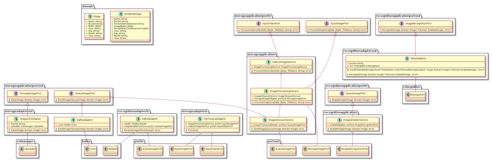

## Architecture


## PlantUml


#### (Autogenerated by https://github.com/jfeliu007/goplantuml)

## Installation

### Pre-Requisites

* Install FTP Server. Recommended: [Install WingFTP in very simple steps](documentation/wingFTP/README.md)

* Run docker-compose: https://github.com/wurstmeister/kafka-docker

    - Configure docker-compose.yml:

    ```
        version: '2'
        services:
        zookeeper:
            image: wurstmeister/zookeeper
            ports:
            - 2181:2181
        kafka:
            build: .
            ports:
            - 9092:9092
            environment:
            KAFKA_ADVERTISED_HOST_NAME: localhost
            KAFKA_ADVERTISED_LISTENERS: PLAINTEXT://localhost:9092 #to access from host
            KAFKA_CREATE_TOPICS: "images:1:1"
            KAFKA_ZOOKEEPER_CONNECT: zookeeper:2181
            volumes:
            - /var/run/docker.sock:/var/run/docker.sock

    ```

    - Start: docker-compose up -d
    - Stop: docker-compose stop

* Set Up Environment variables:

```
    - AWS_ACCESS_KEY_ID=XXX
    - AWS_SECRET_ACCESS_KEY=XXX
    - FTP_DIRECTORY=/home/ariel/images/ #The directory where your FTP save the images.
    - CAMARA_DOMAIN=camarasilvia # In case of S3 it's used to define the "bucket" name
    - QUEUE_TOPIC=images
    - QUEUE_BROKER_LIST=localhost:9092 #abc.com/kafka1/:80,abc.com/kafka2/:80,abc.com/kafka3/:80
```
