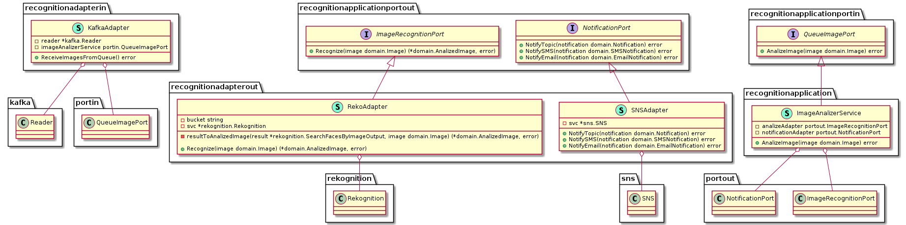
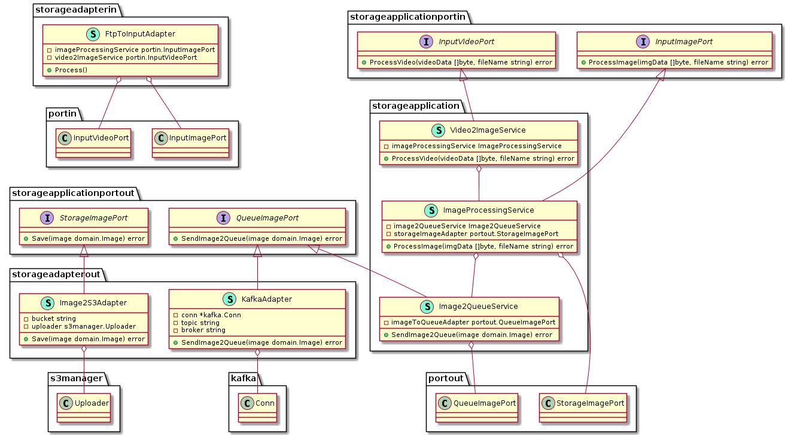

## Powered by
https://github.com/jfeliu007/goplantuml

### Run from project root directory:

goplantuml -recursive  -aggregate-private-members -show-aggregations -show-implementations . 

### Configuration Core

### Recognition Core

### Storage Core
