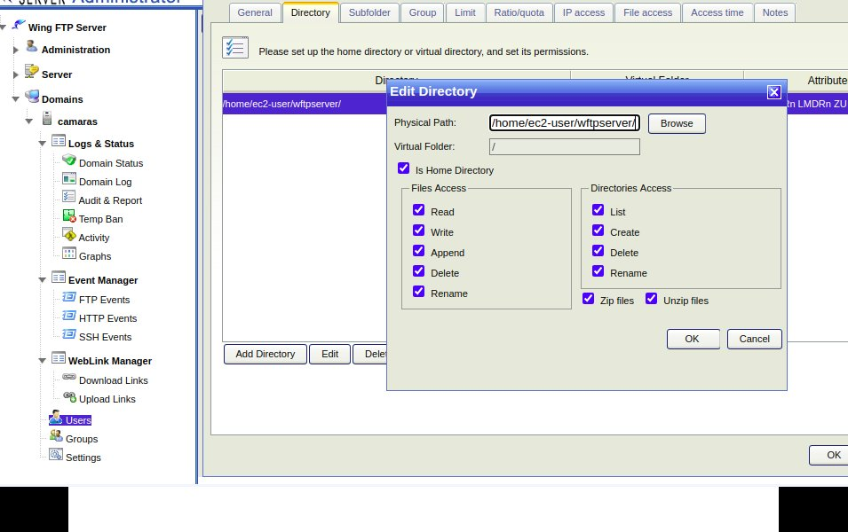
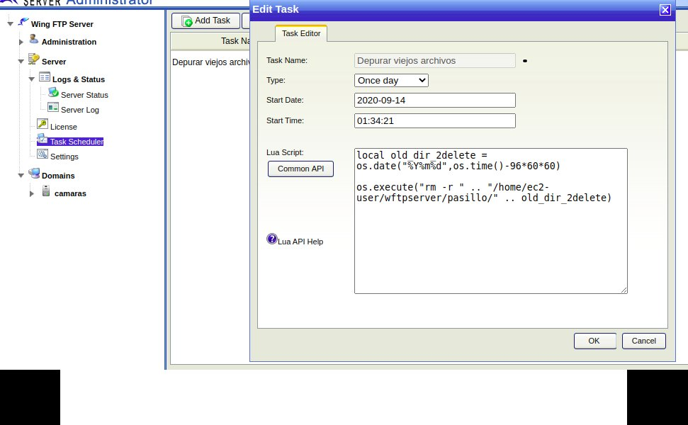

## WingFTP Configuration

- Download: https://www.wftpserver.com/

- After installing WingFTP, Login to Console: http://yourIP:5466/admin_login.html

- Configuration

- User Configuration

- Task Configuration (Ex: if you want to delete old files)

- If you dont't want to use wingFTP tasks, You can make a linux cron to depure old dirs. Check [depureFtpDirs.sh](../../tools/depureFtpDirs.sh)