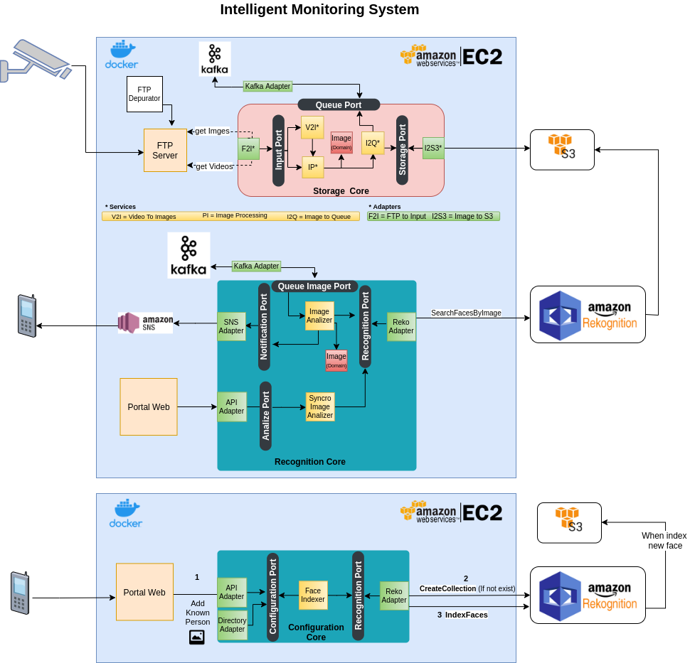

<h1 align="center"></h1>

Its a Simple free Software to make a monitoring system based on Face Recognition using standars IP cameras. They only need to be able to send images to an FTP Server.

I developed it implementing Hexagonal Architecture (or Ports & Adapters architecture ). You can see on the diagram that is very simple to add anothers adapters to process images. In fact, you can easily change AWS Recognize component with another.

Coming soon: Api Adapter

